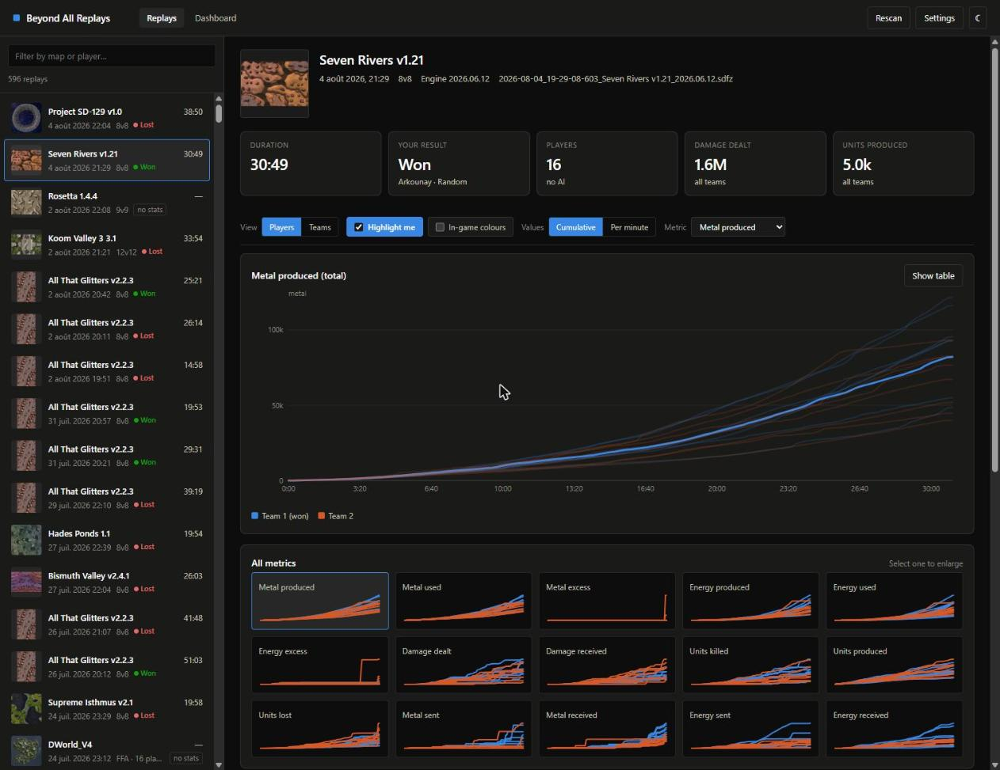
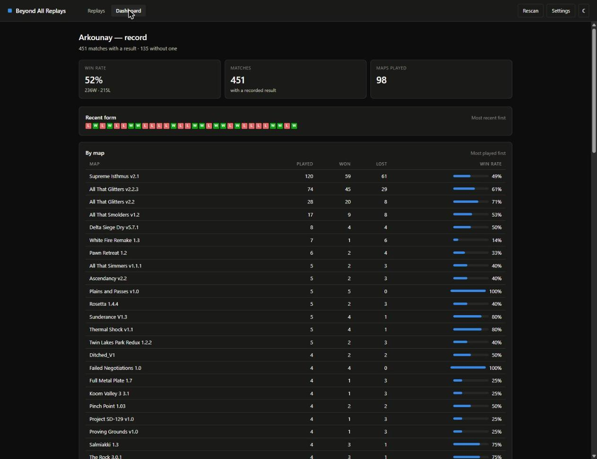
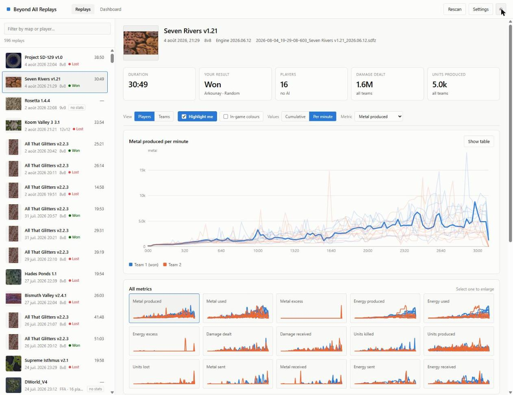

# BAR Stats

Browse your [Beyond All Reason](https://www.beyondallreason.info/) match
statistics locally — while you sit in the lobby waiting for the next game.

BAR writes a replay for every match you play. Everything the end-game graph
window shows is already in those files, sitting on your disk. This reads them
and gives you the whole history: economy and combat over time, per player, for
every match you have ever played.

No account, no upload, no network access. It reads the files you already have
and serves a page on `127.0.0.1`.



## Install

Download from [Releases](https://github.com/Arkounay/bar-stats/releases),
extract, and run it.

Each download holds the same app in two flavours — run whichever you prefer:

| | |
|---|---|
| `barstats-desktop` | Opens as a standalone window. Closing the window quits. |
| `barstats` | Opens a tab at `http://127.0.0.1:8730` and keeps serving after you close it. |

The desktop flavour borrows an installed Chromium browser (Chrome, Brave,
Vivaldi, Edge, …) to draw its window, so it stays a small download rather than
bundling a second browser. If it cannot find or start one it falls back to
opening a normal browser tab, and `-browser` asks for that on purpose.

On Linux that means a browser installed from a distribution package, from the
vendor's own `.deb`/`.rpm`, or under `/opt`. A browser installed through Flatpak
or Snap is sandboxed away from the profile directory the window needs, so those
take the fallback and open a tab instead.

**On Windows you almost certainly want `barstats-windows-amd64.zip`** — that is
the build for a normal 64-bit PC. Only take `windows-arm64` if you know you have
an ARM machine (a Snapdragon-based Surface, for example).

| Platform | Download |
|---|---|
| Windows, normal PC | `barstats-windows-amd64.zip` |
| Windows on ARM | `barstats-windows-arm64.zip` |
| Linux | `barstats-linux-amd64.tar.gz` |
| macOS, Apple Silicon (M1 and later) | `barstats-darwin-arm64.tar.gz` |
| macOS, Intel | `barstats-darwin-amd64.tar.gz` |

On first run it looks for your BAR install and offers the replay folders it
finds — pick one and it starts indexing. Several hundred replays take a few
seconds; after that it is instant.

Then set your player name in Settings to unlock win/loss marks and the
dashboard.

Flags: `-port` (default 8730, `0` picks a free one); `-no-open` on `barstats` to
skip opening a browser, `-browser` on `barstats-desktop` to use a browser tab
instead of a window.

The desktop build has no console to print to on Windows, so it writes what it
would have said — which browser it found, why it fell back to a tab, which port
it settled on — to `barstats-desktop.log` in the cache folder shown in Settings.

Every release ships `SHA256SUMS.txt`, and each asset's SHA-256 is listed on the
release page, so a download can be verified against what CI built from this
source.

### Build from source

Requires Go 1.26+. There is no frontend build step — the UI is plain HTML, CSS
and JavaScript, embedded into the binary.

```sh
go build -ldflags "-s -w" -o barstats ./cmd/barreplays

# The desktop flavour. On Windows add -H windowsgui to the ldflags so the
# application does not carry a console window behind it.
go build -ldflags "-s -w" -o barstats-desktop ./cmd/barstats-desktop
```

## Why

The in-game graph window disappears when you leave the match. Once you are back
in the lobby, the game you just played is gone.

This keeps all of it. Alt-tab out of the lobby, look at why you lost, and be
back before the next map loads.

- **Every match, not just the last one** — 600 replays index in a few seconds
- **Runs alongside the game**, not inside it. No widget, nothing to install into
  BAR, nothing that touches your game files
- **New matches appear on their own** — it watches the replay folder, so the
  game you just finished is there when you alt-tab

## What you get

**Per match** — economy, combat and unit statistics over time, as cumulative
totals or per-minute rates. Every metric at a glance in a small-multiples grid;
click one to enlarge it. A roster with end-of-match totals, faction, chevron,
lobby skill rating and APM.

Set your player name in Settings and it marks which matches you won, adds a
"Highlight me" toggle that picks your line out of a crowded chart, and builds:

**A dashboard** — your record overall, by map and by faction.



Per-minute rates are usually the more revealing view — you can see the economy
ramp, the plateau, and the collapse when a side dies.



## What is in a replay

A `.sdfz` is a gzip-compressed Spring/Recoil demo file:

```
[0, 352)   header — engine version, game ID, start time, chunk sizes
           start script — plain-text TDF: map, players, teams, ally teams, colours
           demo stream — raw network packets (only the head is read)
           winning ally teams
           player statistics — 20 bytes each: mouse, keys, command counts
           team statistics — the time series
```

The team statistics chunk is an `int32` sample count per team followed by each
team's samples, 80 bytes apiece: a frame counter, twelve `float32` economy and
damage totals, and seven `int32` unit counts. The engine samples every 15
seconds, and every value is a running total — per-minute rates are derived by
differencing consecutive samples.

**The demo stream is almost never parsed.** Every statistic comes from the
header, the start script and the trailing chunks, which is what keeps a full
index to seconds rather than minutes. The one exception is the first megabyte of
packets, searched for the colours the game broadcasts as the match loads — see
[A note on colour](#a-note-on-colour).

Three facts drive much of the design:

- **Statistics are written when recording finalises.** A match that was quit or
  crashed out of leaves a valid header with zeroed counts. Those replays are
  listed, flagged `no stats`, and still show their roster from the start script.
- **A zero-length `.sdfz` is a match in progress** — the game creates the file at
  match start.
- **The game appends to the demo throughout the match**, so a file touched moments
  ago may still be being written. Files are left alone until untouched for 10s,
  which stops a live match being parsed half-written.

Start positions are *not* available: BAR runs with `startpostype=2` ("choose in
game"), so the start script carries no coordinates. They exist only as
`NETMSG_STARTPOS` packets inside the demo stream, and plotting them would also
need the map's world dimensions from the map archive.

## Layout

```
cmd/barreplays        entrypoint, browser flavour
cmd/barstats-desktop  entrypoint, standalone-window flavour
cmd/inspect           dumps one replay to the terminal — decoder debugging
internal/app          startup shared by both entrypoints, and how each shows the UI
internal/demo         the decoder. No I/O beyond an io.Reader; no knowledge of HTTP
internal/config       settings persistence + replay-folder detection
internal/gamefiles    reads map previews out of the installed game's archives
internal/index        folder scan, two-phase indexing, on-disk cache
internal/server       HTTP API, view models, embedded web UI
```

### Two-phase indexing

The two kinds of information cost very different amounts to read, so they are
read separately:

1. **Header pass** — map, date, players. These sit at the front of the file, so
   only a few hundred kilobytes are decompressed per replay. The list appears
   almost immediately.
2. **Enrichment pass** — outcome and totals. These sit *behind* the demo stream,
   which in a gzip container can only be reached by decompressing the whole file.
   This runs on a worker pool and its results are cached, so only the first run
   pays for it.

Sample series are never held in memory; a replay's series are re-read on demand
when it is opened.

### Staying current

Both watch modes converge on the same check — hash the folder listing, rescan
when it differs — so filesystem events are only a *trigger*, and the refresh
stays correct however reliable the platform's notifications turn out to be.

| Mode | Behaviour |
|---|---|
| `events` (default) | fsnotify on the replay folder, falling back to polling if the watch cannot be established. A slow 2-minute poll runs alongside as a safety net. |
| `poll` | Re-lists the folder every 15s. For network shares and synced folders. |
| `off` | Only the Rescan button refreshes. |

Events are debounced by a 3-second quiet period; without it a single match would
trigger a rescan per flush. Rescans are non-destructive: the index keeps serving
its current records until the new pass has a complete set to swap in.

A finished match needs one more thing to appear promptly. The write that
finalises the demo is the last event the folder will ever produce, and the
rescan it triggers arrives while the file is still inside its 10-second settle
window — finding nothing. So the scan also reports when the earliest file it
skipped becomes readable, and the watcher waits exactly that long before looking
again. Without it a replay would not surface until some later tick, up to the
2-minute safety net away.

### Map previews

Previews come out of the installed game, so they work offline and match what the
lobby shows. BAR stores content in the rapid pool format:

```
<data>/packages/<hash>.sdp    gzip-compressed index: length-prefixed path + MD5
<data>/pool/ab/cdef… .gz      one gzip-compressed file, addressed by its MD5
```

A map's preview lives at `…/minimapthumbnail/<name>.png`, where `<name>` is the
map's display name lower-cased with spaces replaced by underscores. The game
directory is inferred from the replay folder's parent; if it is not there,
previews are silently unavailable.

**Nothing in this app writes to the game directory.**

## Extending it

**Adding a statistic**: add the field to `demo.Sample` in the position the engine
writes it, decode it in `decodeSample`, and add one entry to `demo.Metrics`. The
API publishes the registry and the UI builds its chart list, roster columns and
headline tiles from that response — no frontend change needed. Bump
`cacheVersion` so existing caches rebuild.

### A note on colour

Chart series use a fixed eight-slot categorical palette, validated for
colour-blind separation against both the light and dark surfaces. Slots are
assigned per entity and never cycled: a team holds its slot until deselected, so
changing the selection never repaints the others. Past eight teams there are not
enough distinguishable hues, so the chart colours by side instead and identity
moves to hover emphasis and the roster.

**In-game colours** are available as an opt-in toggle — they are what you
actually saw in the match, at the cost of those guarantees, since teammates are
often near-identical and some are unreadable against the chart surface.

They do not come from the start script. BAR ignores the `rgbcolor` the lobby
writes there — matchmaking hands every team the same placeholder — and assigns
its own from a palette as the match loads. That gadget broadcasts the result as
a LuaRules message expressly so replay readers can recover it, which is why the
head of the demo stream is worth reading and the script's colours are only a
fallback.

## Tests

```sh
go test ./...
```

The decoder tests build synthetic demo files byte by byte. That is the part worth
pinning: correctness rests on field offsets matching the engine's structs, and a
wrong offset yields plausible-looking numbers rather than an error.

## License

MIT — see [LICENSE](LICENSE).

Not affiliated with the Beyond All Reason project.
